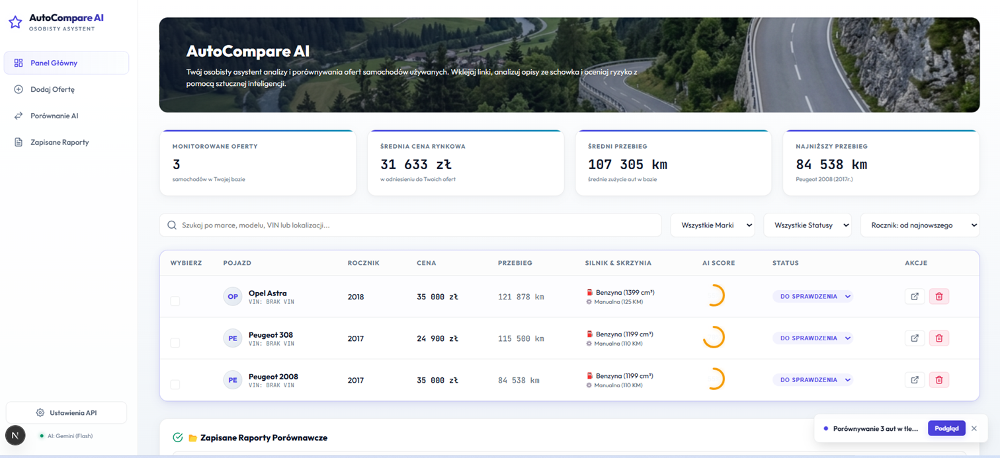
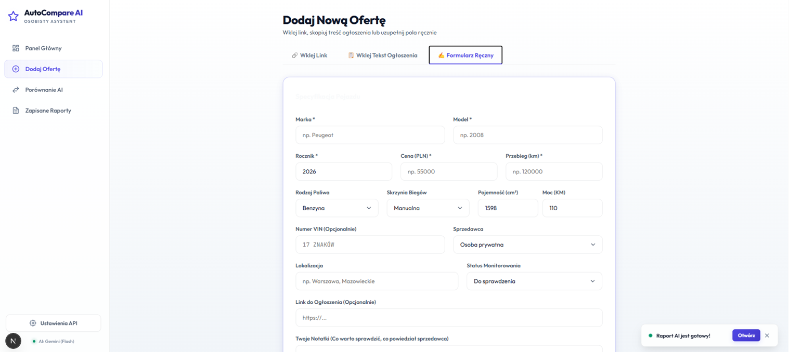
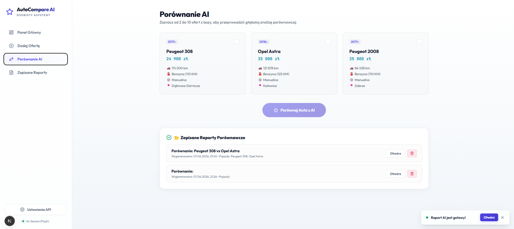
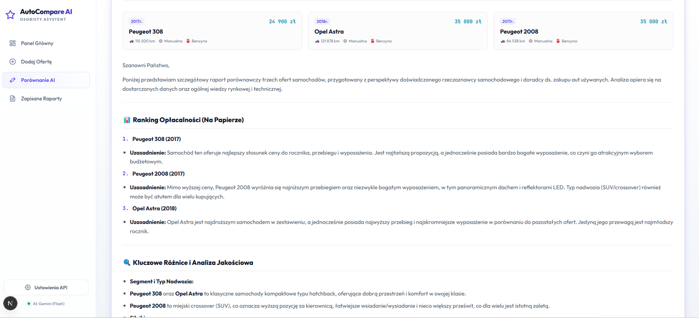
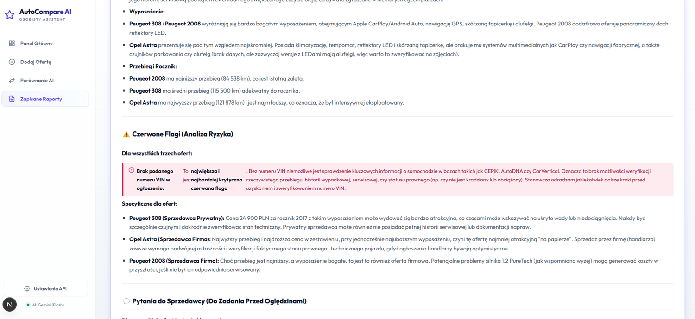

# 🚗 AutoCompare AI – Osobisty Asystent Zakupu Samochodu

**AutoCompare AI** to nowoczesna, lokalna aplikacja webowa stworzona, aby ułatwić i uporządkować proces zakupu używanego samochodu. Zamiast przeklejać dane z dziesiątek kart ogłoszeń (np. Otomoto, OLX) do Excela, aplikacja pozwala na szybkie gromadzenie ofert, automatyczne wyciąganie parametrów z opisu i generowanie szczegółowych raportów porównawczych przy użyciu sztucznej inteligencji (Gemini lub OpenAI).

---

## 🌟 Kluczowe Funkcjonalności

*   **Szybkie dodawanie ofert na 3 sposoby:**
    *   **Wklej Tekst Ogłoszenia:** Wklej surową treść skopiowaną z ogłoszenia. Lokalny parser w ułamku sekundy automatycznie wyciągnie takie parametry jak: marka, model, rocznik, cena, przebieg, numer VIN, silnik, skrzynia biegów, wyposażenie i lokalizacja.
    *   **Wklej Link:** Szybkie dodawanie na bazie adresu URL.
    *   **Formularz Ręczny:** Wygodne wprowadzanie danych krok po kroku.
*   **Generowanie raportów AI w tle:**
    *   Proces wysyłania zapytania i generowania raportu przez model językowy odbywa się w tle (dzięki React Context). Możesz swobodnie przeglądać inne zakładki aplikacji w trakcie trwania analizy. O statusie informuje świecący widżet w prawym dolnym rogu.
*   **Kompleksowy Raport Porównawczy AI:**
    *   **Ranking Opłacalności:** Ocena aut na papierze i ułożenie ich od najbardziej obiecującego.
    *   **Kluczowe Różnice:** Porównanie wersji silnikowych, wyposażenia i przebiegu.
    *   **Czerwone Flagi (Analiza Ryzyka):** Wypunktowanie zagrożeń (np. brak VIN w ogłoszeniu, podejrzanie niska cena, uszkodzenia w opisie).
    *   **Trudne Pytania do Sprzedawcy:** Dedykowana lista pytań do zadania przed wyjazdem na oględziny.
    *   **Checklista Oględzin:** Indywidualna lista kontrolna dopasowana pod dany silnik/skrzynię biegów (np. weryfikacja DPF/dwumasy dla diesla).
*   **Pełna Prywatność i Bezpieczeństwo:**
    *   Aplikacja działa w 100% lokalnie w przeglądarce (`client-only`). Brak zewnętrznej bazy danych – wszystkie oferty i raporty są zapisywane w pamięci podręcznej przeglądarki (`localStorage`).
    *   Twoje klucze API Gemini lub OpenAI są bezpiecznie przechowywane tylko na Twoim komputerze i wysyłane bezpośrednio do oficjalnych serwerów dostawców.
*   **Archiwizacja i Druk:**
    *   Raporty porównawcze możesz zapisać w pamięci programu, a także łatwo wydrukować lub wyeksportować do formatu PDF.

---

## 📸 Zrzuty Ekranu

### Panel Główny (Dashboard)
Centrum dowodzenia. Zawiera statystyki średnich cen i przebiegów dodanych pojazdów, listę ofert, a także filtry i wyszukiwarkę.


### Dodawanie Oferty
Szybkie wprowadzanie parametrów z automatycznym parserem treści ze schowka.


### Panel Porównania AI
Wygodny wybór pojazdów do porównania side-by-side oraz historia wygenerowanych raportów.


### Raport AI (Ranking Opłacalności)
Początek szczegółowej analizy dokonanej przez AI w postaci rankingu opłacalności z uzasadnieniem.


### Analiza Ryzyka (Czerwone Flagi)
Przykładowe ostrzeżenie wygenerowane przez AI w przypadku braku kluczowych informacji w ogłoszeniu (np. numeru VIN).


---

## 🚀 Jak Uruchomić Aplikację

Aplikację można uruchomić na dwa sposoby:

### Sposób 1: Jednym kliknięciem (Windows)
W katalogu głównym projektu znajduje się plik **`Uruchom_Aplikacje.bat`**. 
1. Kliknij na niego dwukrotnie.
2. Skrypt automatycznie uruchomi lokalny serwer w tle i po 2 sekundach otworzy aplikację w domyślnej przeglądarce pod adresem: **`http://localhost:3000`**.

### Sposób 2: Klasycznie przez terminal
Jeśli wolisz uruchomić aplikację ręcznie:
1. Zainstaluj zależności (przy pierwszym uruchomieniu):
   ```bash
   npm install
   ```
2. Uruchom serwer deweloperski:
   ```bash
   npm run dev
   ```
3. Otwórz w przeglądarce adres: [http://localhost:3000](http://localhost:3000).

---

## 🔑 Konfiguracja API AI

Aby móc generować raporty przy pomocy sztucznej inteligencji:
1. Wejdź w zakładkę **Ustawienia API** w lewym dolnym rogu paska bocznego.
2. Wybierz swojego dostawcę API (**Google Gemini** lub **OpenAI**).
3. Wklej swój klucz API:
   * Klucz dla Gemini możesz wygenerować bezpłatnie w [Google AI Studio](https://aistudio.google.com/).
   * Klucz dla OpenAI możesz wygenerować na platformie [OpenAI API](https://platform.openai.com/).
4. Kliknij **Zapisz Ustawienia**. Klucz zostanie zapisany w lokalnej pamięci Twojej przeglądarki.

*Uwaga: W przypadku braku podania klucza API, aplikacja wygeneruje uproszczony raport symulacyjny bazujący na wbudowanych regułach matematyczno-logicznych.*

---

## 🛠️ Użyte Technologie

*   **Framework:** Next.js (React) z Turbopack
*   **Stylizacja:** Czysty CSS (Vanilla CSS) – interfejs zaprojektowany w nowoczesnym stylu *glassmorphism* z pełną obsługą ciemnego motywu.
*   **Język:** TypeScript / JavaScript
*   **Integracja AI:** API Gemini (`gemini-2.5-flash`) oraz API OpenAI (`gpt-4o-mini`) z mechanizmem automatycznego wznawiania zapytań (retry z wykładniczym czasem oczekiwania w przypadku obciążenia serwerów).
